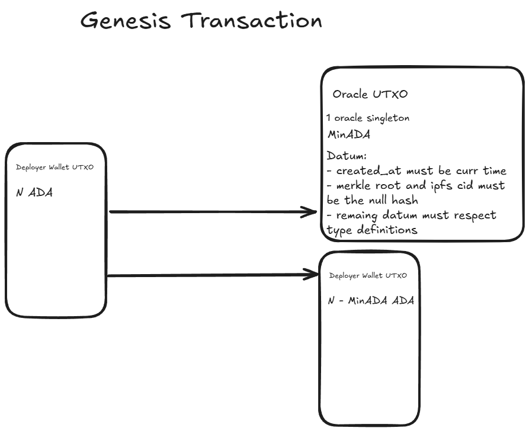
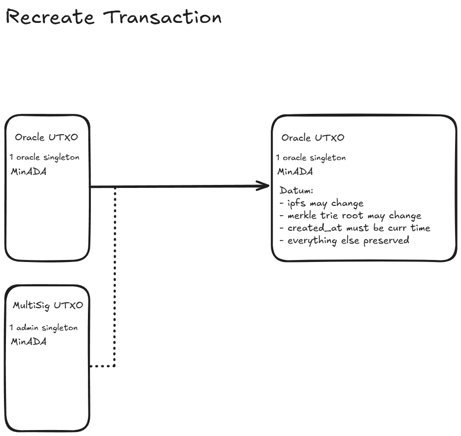
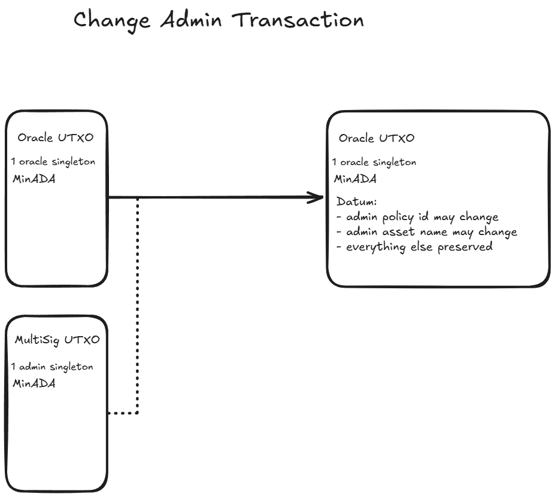
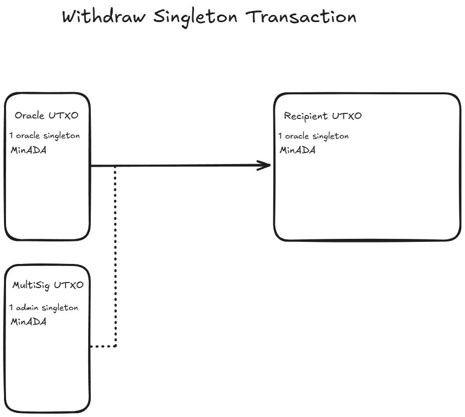
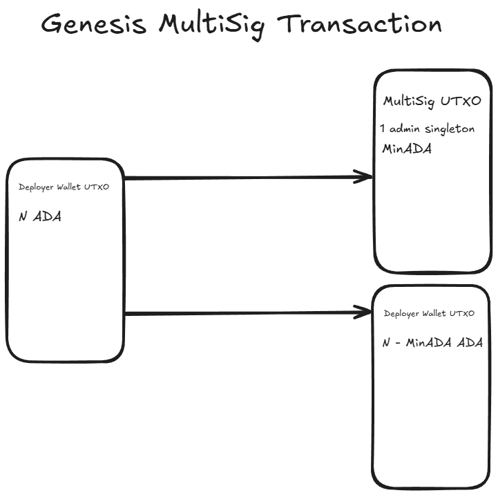
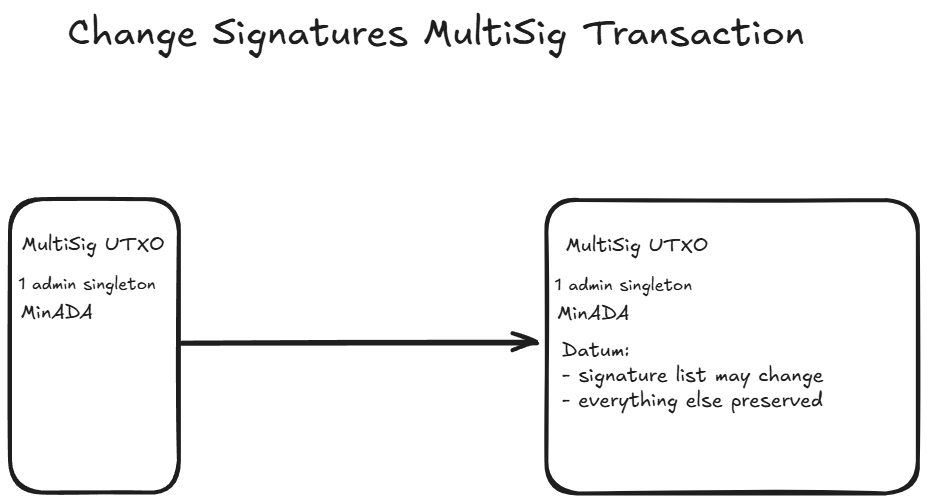
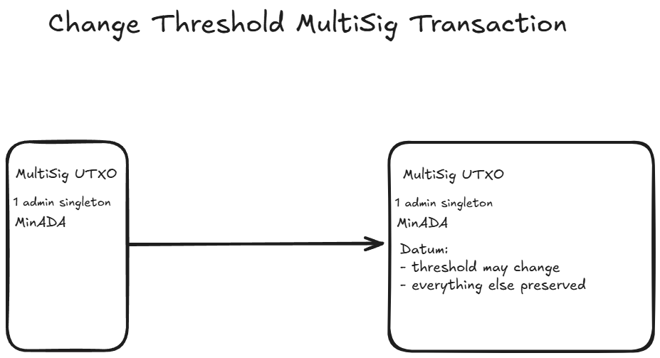

# merkle-oracle

## Building

```sh
aiken build
```

## Configuring

**aiken.toml**
```toml
[config.default]
network_id = 41
```

Or, alternatively, write conditional environment modules under `env`.

## Testing

You can write tests in any module using the `test` keyword. For example:

```aiken
use config

test foo() {
  config.network_id + 1 == 42
}
```

To run all tests, simply do:

```sh
aiken check
```

To run only tests matching the string `foo`, do:

```sh
aiken check -m foo
```

# Documentation

## Introduction

The documentation describes the technical design of the Merke Oracle dApp - the script UTxOs involved and the operations that take place in the oracle lifecycle.

There will be a single `OracleUtxo` and a `MultiSigUtxo`. The former is what holds the oracle state and what consumers will interact with both onchain and offchain. The latter is a multisig contract that the `OracleUtxo` references while doing any transactions. 

## Constants Glossary

- `singleton_asset_name`: The asset name of the oracle singleton.
- `multisig_singleton_name`: The asset name of the multisig singleton.
- `utxo_ref`: The utxo referenced while minting the oracle singleton such that its only ever possible to mint once. 
- `utxo_ref`: The utxo referenced while minting the multisig singleton such that its only ever possible to mint once. 
- `contract_output_index`: The output index of the recreated oracle utxo.
- `null_hash`: The hash of an empty trie.

The `utxo_ref` variable name may be the same for both contracts, but the `utxo_ref` value is different for each contract.

## UTxOs specification

### Oracle UTxO

>#### Address
>
>- Parameterized on `singleton_asset_name` and `utxo_ref`. The validator corresponding to this address is in `merkle-oracle.ak`.
>
>#### Datum
>
>- admin_singleton_policy_id: **PolicyId**
>- admin_singleton_asset_name: **AssetName**
>- merkle_root: **ByteArray**
>- ipfs_cid: **ByteArray**
>- created_at: **Int**
>
>#### Value
>
>- minADA
>- `oracle_singleton`

### MultiSig UTxO

>#### Address
>
>- Parameterized on `multisig_singleton_name` and `utxo_ref`. The validator corresponding to this address is in [`palm-multisig.ak`](https://github.com/zenGate-Global/palm-multisig-aiken/blob/main/validators/palm-multisig.ak).
>
>#### Datum
>
>- threshold_amount: **Int**
>- signatures: **List<MultisigScript>**
>
>#### Value
>
>- minADA
>- `multisig_singleton`

## Transactions

### Genesis Oracle Transaction

This transaction is used to create the unique Oracle UTxO, along with minting the oracle singleton used to identify the UTxO.

The `merkle_root` and `ipfs_cid` are set to `null_hash` in the datum. The `created_at` is set to the current time.



### Recreate Oracle Transaction

This transaction is used to update the ipfs cid and the merkle trie root of the oracle utxo. Also updates the `created_at` as the average of the upper and lower bound of the transaction's validity range (posix time). This will use the multisig UTxO as a reference input to determine if multiple signatures are required.



### Change Admin Oracle Transaction

This transaction is used to update the admin policy id and asset name of the oracle utxo. This will use the multisig UTxO as a reference input to determine if multiple signatures are required. In the datum, everything else must be preserved. 

This transaction will allow a seemingly different multisig UTxO to be referenced going forward.



### Singleton Withdraw Oracle Transaction

This transaction is used to withdraw the oracle singleton from the oracle utxo. This will use the multisig UTxO as a reference input to determine if multiple signatures are required.

This is a **destructive** operation as the oracle UTxO will **NOT** be recreated. 

The singleton asset is withdrawn to the address matching the VFK from the redeemer.



### Genesis MultiSig Transaction

This transaction is used to create the unique MultiSig UTxO, along with minting the multisig singleton used to identify the UTxO.



### Change Signatures MultiSig Transaction

This transaction is used to update the signatures list of the multisig utxo. Multiple signatures may be required based on its threshold requirements.

The threshold amount is not updated in this transaction.



### Change Threshold MultiSig Transaction

This transaction is used to update the threshold amount of the multisig utxo. Multiple signatures may be required based on its threshold requirements.

The signatures list is not updated in this transaction.



## Validators & Minting Policies

## Oracle Multivalidator

Includes Oracle Validator and the Oracle Minting Policy.

### Oracle Validator

- Params: `singleton_asset_name` and `utxo_ref`.

#### *Recreate Redeemer*
- Oracle UTxO must be recreted with the singleton asset preserved.
- Datum done as described in the UTxO specification.
- MultiSig UTxO must be referenced as a reference input.
- Extra Signatures must meet threshold as described in the datum of the multisig UTxO.
- Validity range provided with a max delta of 300 seconds.

#### *Change Admin Redeemer*
- Oracle UTxO must be recreated with the singleton asset preserved.
- Datum done as described in the UTxO specification.
- MultiSig UTxO must be referenced as a reference input.
- Extra Signatures must meet threshold as described in the datum of the multisig UTxO.
- Validity range provided with a max delta of 300 seconds.

#### *Singleton Withdraw Redeemer*
- Redeemer parameterized with a VFK.
- Singleton asset is withdrawn to the address matching the VFK.
- Datum done as described in the UTxO specification.
- MultiSig UTxO must be referenced as a reference input.
- Extra Signatures must meet threshold as described in the datum of the multisig UTxO.
- Validity range provided with a max delta of 300 seconds.

### Oracle Minting Policy

- Params: same as the Oracle Validator.

#### *Genesis Redeemer*
- utxo_ref as parameterized must be in the transaction inputs.
- single asset is minted respecting the asset name as parameterized.
- asset must go to Oracle UTxO
- Datum done as described in the UTxO specification.
- Validity range provided with a max delta of 300 seconds.

## MutliSig MultiValidator

Includes the MultiSig Validator and the MultiSig Minting Policy.

### MultiSig Validator

- Params: `multisig_singleton_name` and `utxo_ref`.

#### *Change Signatures Redeemer*
- Datum done as described in the UTxO specification.
- Extra Signatures must meet threshold as described in the datum of the multisig UTxO.

#### *Change Threshold Redeemer*
- Datum done as described in the UTxO specification.
- Extra Signatures must meet threshold as described in the datum of the multisig UTxO.

### MultiSig Minting Policy

- Params: same as the MultiSig Validator.

#### *Genesis Redeemer*
- utxo_ref as parameterized must be in the transaction inputs.
- single asset is minted respecting the asset name as parameterized.
- asset must go to MultiSig UTxO
- Datum done as described in the UTxO specification.
